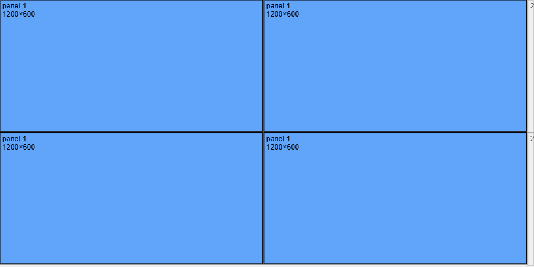
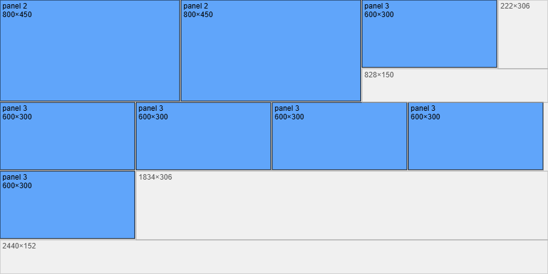

# 🪵 Ply Cutting Optimizer (React + Vite + Tailwind)

A visual plywood‑cutting optimization tool built with **React**, **Vite**, and **Tailwind CSS**.  
It uses a custom **bin‑packing algorithm** with kerf support to generate efficient cutting layouts for carpenters, CNC operators, and workshop professionals.

---

## 🚀 Features

### 🔹 Smart Bin‑Packing Algorithm
- Sorts panels by longest side for optimal placement  
- Supports rotation  
- Guillotine‑style rectangle splitting  
- Kerf spacing (user‑defined)  
- Accurate waste rectangle calculation  

### 🔹 Clean Visual Layout
- Each ply rendered on a canvas  
- Panels color‑coded (rotated vs non‑rotated)  
- Kerf lines drawn around each panel  
- Waste rectangles labeled with dimensions  
- Auto‑scaled to fit screen  

### 🔹 Export Options
- Export **each ply** as PNG  
- Export **all plies together** as one PNG  

### 🔹 Modern UI
- Built with React + Vite  
- Tailwind CSS styling  
- Live preview of panels and ply entered  

---

### Ply Layout Example

for inputs : 
Plywood:
2440 × 1220 mm
18mm thickness
3mm kerf

Panels:
1200 × 600 × 4
800 × 450 × 2
600 × 300 × 6

the output :

Total Plies Required: 2

Ply 1
Dimensions: 2440 × 1220

Panels Placed:
panel 1 — 1200×600 at (0,0)
panel 1 — 1200×600 at (1206,0)
panel 1 — 1200×600 at (0,606)
panel 1 — 1200×600 at (1206,606)
Waste Rectangles:
28×606 at (2412,0)
28×606 at (2412,606)
Ply 2
Dimensions: 2440 × 1220

Panels Placed:
panel 2 — 800×450 at (0,0)
panel 2 — 800×450 at (806,0)
panel 3 — 600×300 at (1612,0)
panel 3 — 600×300 at (0,456)
panel 3 — 600×300 at (606,456)
panel 3 — 600×300 at (1212,456)
panel 3 — 600×300 at (1818,456)
panel 3 — 600×300 at (0,762)
Waste Rectangles:
222×306 at (2218,0)
828×150 at (1612,306)
1834×306 at (606,762)
2440×152 at (0,1068)

## 🖼️ Screenshots

